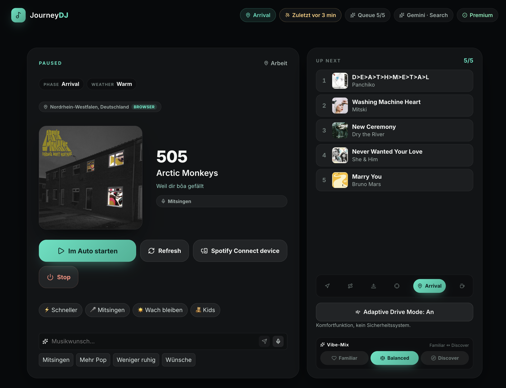

# AI Journey DJ

[](https://github.com/Hiepler/AiJourneyDj/actions/workflows/ci.yml)
[](LICENSE)
[](#contributing)

> Self-hosted, telemetry-aware music engine for Tesla road trips. It turns live drive context into
> Spotify queues with a deterministic core and one LLM-assisted track-discovery step.

AI Journey DJ scores a drive as it unfolds: pace and trend, navigation phase, ETA, region, traffic
delay, time of day and journey moments such as a border crossing or jam release. You start a trip,
pick a vibe, choose a Spotify Connect device, and the system keeps curating forward instead of
holding one static playlist.

- **Built for the cockpit:** large-screen React UI, Spotify Connect, native Tesla Spotify support,
  no typing required while driving.
- **Built for inspection:** TypeScript monorepo, deterministic recommendation logic, seeded ranking,
  unit tests and mock providers.
- **Built as an open experiment:** the repo makes a telemetry-and-music hypothesis testable; it is
  not proof of a behavioral effect and not a safety system.



## Contents

- [Why this is different](#why-this-is-different)
- [How it works](#how-it-works)
- [Engineering notes](#engineering-notes)
- [Research question](#research-question)
- [Features](#features)
- [Quick start](#quick-start-mock-mode)
- [Going live](#going-live)
- [Architecture](#architecture)
- [Privacy](#privacy)
- [Project status & limitations](#project-status--limitations)
- [Contributing](#contributing)
- [License](#license)

## Why this is different

- **Telemetry as a time-series, not a label.** The engine reads speed, trends, ETA, route phase,
  traffic delay, weather proxies and coarse region as signals that change during the drive.
- **Deterministic core, LLM at the edge.** Pure, zero-token, unit-tested logic decides the musical
  brief, narrative arc, ranking, diversity and no-repeat behavior. The model never sees the brief
  object — it only resolves real, currently-released tracks for an intent the engine already fixed,
  web-grounded so it can't hallucinate songs.
- **Journey moments, not just recommendations.** Jam release, border crossing, golden hour, arrival
  and Adaptive Drive Mode can bias the next set without hard-cutting the current song.
- **Open measurement surface.** The same system that generates the queue can expose opt-in signals
  for studying whether telemetry-adaptive music correlates with specific driving indicators.

## How it works

A drive is treated as a trajectory: departure, rhythm, interruptions, release, arrival. The music
engine turns that trajectory into a forward-only Spotify queue.

```
Tesla telemetry  ->  deterministic Musical Brief  ->  LLM finds real tracks  ->  scored & ordered  ->  Spotify
 (signals/time)      (energy, mood, arc, moments)     (the only AI step)        (seeded, no-repeat)
```

The core decides **what kind of music** fits the moment: energy, valence, genre hints, era, drive
act, situational role and diversity constraints. Track discovery then resolves that intent into real
Spotify-playable songs. Ranking and queue reconciliation stay deterministic so playback can be
tested, debugged and resumed across browser, phone and native Tesla Spotify devices.

For the full engine design, see [docs/architecture.md](docs/architecture.md).

## Engineering notes

The details worth defending on engineering grounds:

- **Deterministic core, zero tokens.** The Musical Brief (energy/valence/genre/era/role), the
  drive-story acts, the journey-moment detector and the calm/focus classifier are pure functions
  over telemetry — seeded, reproducible and unit-tested. AI runs for exactly one step: resolving
  the fixed brief into real, currently-released tracks.
- **No-repeat guarantee.** Every song plays at most once per journey, deduped by exact track _and_
  normalized song key — so "Song" and "Song – Live/Extended/Remaster" count as one.
- **Append-only queue reconciliation.** Spotify's Web API cannot reorder or remove queued items, so
  the engine models a small forward window and only appends, never duplicating — and survives native
  skips, external playback and a browser backgrounded for 30 minutes.
- **Discovery without an echo chamber.** Momentum Radio walks the Last.fm similar-artist graph out
  from what's playing and _inverts_ popularity (favoring ranks ~5–30) for the great-but-not-obvious
  neighbors of music you already like; a cross-journey artist ledger hard-bans recently-heard
  artists.
- **Cost-aware by design.** AI runs only when the vibe actually changes (phase shift, moment, wish);
  routine buffer top-ups reuse the pre-generated pool, and a persistent search cache keeps a 10-hour
  drive to a handful of calls, not a stream.
- **Graceful and env-gated.** Every Spotify, AI, telemetry and Last.fm dependency degrades quietly,
  and every engine feature is individually env-gated (defaults on) so you can A/B your own setup.

## Research question

The project started with a hypothesis: if music continuously fits the _actual_ drive, the driving
experience, and perhaps some measurable driving indicators in specific situations, might shift with
it. A calmer soundtrack in stop-and-go traffic; a more engaging one on a monotonous night highway.

So far this is anecdotal: ~4000 km driven with it, n=1, nothing measured. The point of the repo is
not to claim an effect — it is to make the question testable. The app exposes the measurement surface
you would need for an opt-in study: telemetry-derived pace/acceleration/traffic/ETA on one side, and
music energy/tempo targets, moment events and calm/focus bias on the other.

Prior work has studied music, arousal, workload and driving indicators, including Brodsky (2001),
Ünal et al. (2013), Wen et al. (2019) and a 2024 meta-analysis of 19 studies. The hypothesis, source
links and a concrete experiment outline live in [docs/research.md](docs/research.md).

AI Journey DJ is **not a safety system, not driver assistance and claims no proven effect on
behavior, attention or driving performance**.

## Features

- **Cockpit UI** for the landscape touchscreen with large tap targets, glanceable context and a
  server-generated "why this song" line.
- **Live journey start** that can use current navigation, ETA, region and phase when Tesla telemetry
  is connected.
- **Spotify Connect device picker** for the browser player, phone, desktop or the car's native
  Spotify player.
- **Journey Moments & Drive Story** for narrative queue shaping, local context and celebratory
  cockpit banners such as "Welcome to Italy!".
- **Adaptive lenses** chosen per drive from a catalog — a geo-soundtrack lens (artists with a real
  connection to the route, found via web search), a local-language lens (Italian near Garda, French
  near Montpellier) and a deep-cut explorer — instead of always running the same generators.
- **Tap-to-steer controls** for faster, singalong, stay-awake, drive phase and familiar/discover
  mix.
- **Music wishes** by text or voice, mapped into artist boosts, avoids, tempo shifts or mood nudges.
- **Kids mode and synced lyrics** with clean singalong bias and LRCLIB-powered karaoke fallback.
- **Adaptive Drive Mode** that biases song selection toward calm or focus from live telemetry. This
  is a comfort feature only.
- **Background playback support** with MediaSession and keep-alive behavior for minimized browser
  playback.
- **Journey playlist mirroring** into a private Spotify playlist named for the trip.

## Quick start (mock mode)

Mock mode needs no Tesla, Spotify, TIDAL, Last.fm or LLM credentials. It lets you start journeys,
watch telemetry-like context change and inspect queue behavior locally.

**Prerequisites**

- Node.js `>=22.13.0`
- npm `>=10.0.0`

```bash
npm install
cp .env.example .env
npm run dev
```

Open `http://localhost:5173`. The Vite dev server proxies the API, so login and OAuth redirects
work on the same origin. The default `.env.example` values keep providers mocked
(`SPOTIFY_MOCK=true`, `TIDAL_MOCK=true`, `XAI_MOCK=true`).

Useful checks:

```bash
npm run typecheck
npm run test
npm run lint
npm run build
```

## Going live

- **Spotify Premium:** create a Spotify app, add `https://<domain>/auth/spotify/callback`, set
  `SPOTIFY_CLIENT_ID`, `SPOTIFY_CLIENT_SECRET` and `SPOTIFY_MOCK=false`, then reconnect once.
- **LLM track scout:** set `XAI_MOCK=false` and `GEMINI_API_KEY`. `SONG_SCOUT=multilens` is the
  default; Grok can be used as an optional fallback.
- **Last.fm:** set `LASTFM_API_KEY` for geo/tag charts and Momentum Radio. Without it, those sources
  degrade gracefully.
- **Tesla telemetry (two ingestion modes):** optional for local development, required for real
  vehicle signals. Both feed the same engine; pick one based on your infra:
  - **Fleet API polling** (`TESLA_FLEET_ENABLED=true`, `TESLA_POLL_SECONDS=120`) — the simplest
    path. Each tick is one billed `vehicle_data` request, so changes react at the poll cadence.
  - **Fleet Telemetry streaming** (`TESLA_TELEMETRY_ENABLED=true`) — the car pushes signals over an
    MQTT bridge for near-real-time updates and no per-tick billing. It becomes the primary source
    (REST polling stays as an automatic fallback), at the cost of running Tesla's `fleet-telemetry`
    server and command proxy.

  Setup and deployment steps for both are in [docs/deployment.md](docs/deployment.md).

The advanced engine features (drive story, journey moments, momentum radio, variety doctrine, vibe
directives, why-lines) are enabled by default and individually env-gated in `.env.example`. Confirm
provider state at `GET /health`.

## Architecture

This is an npm-workspaces TypeScript monorepo:

| Area                                                    | Responsibility                                                                    |
| ------------------------------------------------------- | --------------------------------------------------------------------------------- |
| `apps/web`                                              | React 19 + Vite PWA cockpit                                                       |
| `apps/api`                                              | Fastify API, SQLite, OAuth, playback orchestration, Tesla polling/streaming ingest, journey worker |
| `packages/recommendation`                               | Musical Brief, Drive Story, Journey Moments, lens selection, ranking, variety     |
| `packages/spotify`                                      | Spotify Web API adapter, resolver and playback integration                        |
| `packages/telemetry`                                    | Tesla payload normalization and drive-phase derivation                            |
| `packages/{core,crypto,open-music,tidal,test-fixtures}` | Shared types, encrypted credentials, enrichment, TIDAL fallback, fixtures         |

Core stack: TypeScript, Fastify 5, React 19, Vite, Vitest, Spotify Web Playback SDK + Web API,
Gemini with Google Search grounding, Last.fm API and Tesla Fleet API.

Read the deeper engine walkthrough in [docs/architecture.md](docs/architecture.md).

## Privacy

Data minimization is a design goal:

- Raw GPS is used transiently to derive a coarse region; it is not stored or sent to the LLM.
- The LLM receives abstract journey context only: no VINs, no raw coordinates, no streaming-library
  data and no Spotify/TIDAL catalog dumps.
- Credentials are encrypted at rest in SQLite with `APP_SECRET`.
- Tesla access is read-only and does not wake a sleeping vehicle.

## Project status & limitations

AI Journey DJ is a self-hosted, non-commercial, single-user project. It does not redistribute audio
or expose streaming as a service. Tesla is optional in mock mode; real telemetry requires Tesla Fleet
API access. Spotify is the primary playback target; TIDAL support exists as a fallback path.

Known constraints:

- Spotify Web Playback requires Premium and a DRM/EME-capable browser.
- Whether native Tesla Spotify appears as a Connect device depends on Tesla firmware, region and
  Spotify availability.
- Spotify's Web API cannot reorder or remove queued items, so the engine appends forward and
  reconciles the model queue.
- Telemetry-driven changes react at the Fleet API poll cadence; the optional Fleet Telemetry
  streaming mode lowers latency to near-real-time, but it is still not hard real time.
- Fleet API fields do not include every useful driving signal; weather, rain and cabin context are
  approximations or unavailable.
- Adaptive Drive Mode and journey moments bias song _selection_ only. They do not control vehicle
  behavior, volume, DSP, speed, route or driver-assistance features.

Again: this is **not a safety system, not driver assistance and not evidence of improved driving
performance**.

## Contributing

Issues and PRs are welcome. Especially useful contribution areas:

- opt-in, privacy-respecting measurement logging for the research question
- new recommendation lenses, moment detectors or regional music sources
- telemetry fixtures and simulator scenarios
- Spotify Connect and playback-reconciliation hardening
- docs, setup notes and deployment reports from real self-hosted installs

Before opening a PR, run:

```bash
npm run typecheck
npm run lint
npm run test
npm run build
```

CI runs the same checks on every push.

## License

MIT — see [LICENSE](LICENSE).
